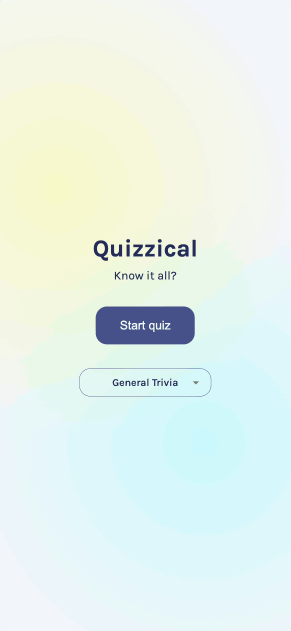

# Quizzical

A React quiz game built for the Scrimba front-end developer path. Used as a learning exercise to practice useState & useEffect.

## Features

- Uses the [Open Trivia Database](https://opentdb.com/) to fetch random trivia questions
- Supports user category selection
- Resilient to API errors & handles user retries
- Dynamically renders game via React components
- Responsive design /w media queries

## Technologies Used

- HTML
- CSS
- JavaScript
- React
- Vite

## Resources

- [Figma design](https://www.figma.com/design/E9S5iPcm10f0RIHK8mCqKL/Quizzical-App)

## Installation

- `npm install`
- `npm run dev` for local server or `npm run build`